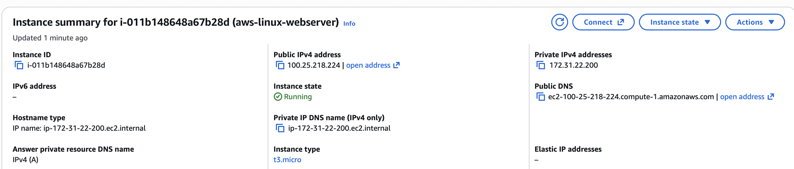

## Screenshots

### 1. EC2 Instance Configuration

### 2. Security Group Configuration

### 3. EC2 Running

### 4. SSH Linux Session

### 5. Linux Networking Commands

### 6. NGINX Web Server Running

### 7. EC2 Hosted Website

### 8. IAM User

### 9. IAM Policy

### 10. IAM Role

### 11. S3 Bucket

### 12. S3 Static Website

